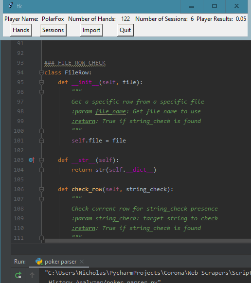

# Poker-Hand-History-Analyzer
A hand history analyzer for online poker players that play on America's Card Room (ACR). (More rooms to come in the future)

# Install/Dependencies
In order to use Poker Hand History Analyzer (PHHA), you will need python 3 along with python modules: csv, datetime, matplotlib, mysql, os, and tkinter. You will also need to MySQL in order to build the database.

# Demo

# Status
V1.01
Currently, this application has the ability to track basic information for the user, such as the number of hands played to the total results of all sessions played. More features are to arrive.
Next feature: better importing, from displaying contents of new imports to caching previous import data to prevent attempting to import already-imported data.

# Credits
Credits to everyone who built all the tools used here to allow me to build this, and to online poker.

# Liscence
MIT @ Nicholas Crook
